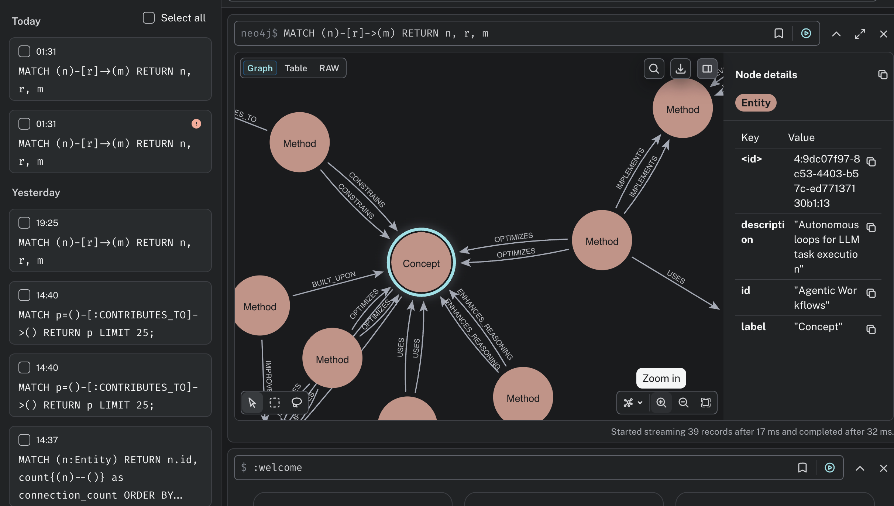

## 🧠 System Architecture

  

This pipeline:

1. Collects research papers from ArXiv
2. Extracts structured entities using LLMs
3. Builds a Neo4j-backed knowledge graph
4. Enables natural-language querying via Cypher
